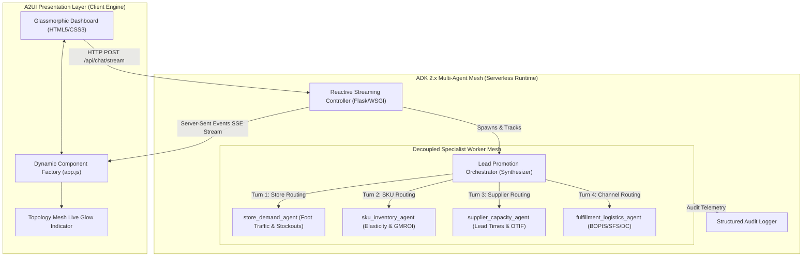
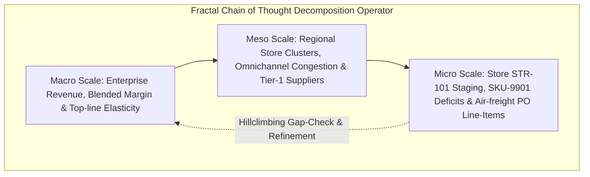

# ⚡ PROMO-SIM: ADK 2.x & A2UI Enterprise Promotion Simulation Platform

[](https://cloud.google.com/)
[](https://cloud.google.com/)
[](https://cloud.google.com/vertex-ai)
[](LICENSE)

> **Enterprise Mission Statement**:  
> *"Before I launch this promotion, show me exactly what will happen across every store, SKU, supplier, and fulfillment channel—and tell me the best intervention if something goes wrong."*

---

## 📑 Table of Contents
1. [Executive System Overview](#-executive-system-overview)
2. [Architectural Blueprint & Topology](#-architectural-blueprint--topology)
3. [Multi-Agent Core & 4-Pillar Mesh](#-multi-agent-core--4-pillar-mesh)
4. [Fractal Chain of Thought (FCoT) Synthesis](#-fractal-chain-of-thought-fcot-synthesis)
5. [A2UI Schema-Driven Dynamic Component Factory](#-a2ui-schema-driven-dynamic-component-factory)
6. [Real-Time SSE JSON-RPC 2.0 Telemetry Stream](#-real-time-sse-json-rpc-20-telemetry-stream)
7. [Prescriptive Interventions & Circuit Breakers](#-prescriptive-interventions--circuit-breakers)
8. [Repository Structure](#-repository-structure)
9. [Quickstart & Local Installation](#-quickstart--local-installation)
10. [Automated Verification & Test Suite](#-automated-verification--test-suite)
11. [Enterprise Cloud Deployment](#-enterprise-cloud-deployment)

---

## 🏛️ Executive System Overview

The **PROMO-SIM** platform is a distributed, multi-agent simulation and risk mitigation system engineered for retail merchandising, omnichannel logistics, and enterprise supply chain executives. Built on the **Google Cloud Agentic Stack** (**ADK 2.x**, **Vertex AI Gemini Enterprise**, and **Agent UI / A2UI**), the system stress-tests high-impact promotional campaigns before capital commitment.

Traditional retail promotion planning relies on siloed, static spreadsheet forecasting that fails to capture downstream supply bottlenecks. PROMO-SIM solves this by orchestrating a specialized mesh of autonomous domain subagents through a **Hub-and-Spoke topology**, synthesizing millions of simulated data points across four critical dimensions into a real-time reactive interface.

```
+---------------------------------------------------------------------------------------------------------+
|                                    PROMO-SIM COGNITIVE AGENTIC PIPELINE                                 |
|                                                                                                         |
|  [Promotional Scope]                                                                                    |
|          │                                                                                              |
|          ▼                                                                                              |
|  ┌───────────────────────────────┐                                                                      |
|  │  Lead Promotion Orchestrator  │ ──► [Macro/Meso/Micro FCoT Recursive Descent]                         |
|  └───────────────┬───────────────┘                                                                      |
|                  │                                                                                      |
|       ┌──────────┼──────────────────────┬──────────────────────┐                                        |
|       ▼          ▼                      ▼                      ▼                                        |
| ┌──────────┐ ┌──────────────┐ ┌──────────────────┐ ┌──────────────────────┐                             |
| │  Stores  │ │  SKU Demand  │ │ Supplier Network │ │ Fulfillment Channels │                             |
| │  Agent   │ │    Agent     │ │      Agent       │ │        Agent         │                             |
| └────┬─────┘ └──────┬───────┘ └────────┬─────────┘ └──────────┬───────────┘                             |
|      │              │                  │                      │                                         |
|      └──────────────┴──────────────────┴──────────────────────┘                                         |
|                                    │                                                                    |
|                                    ▼                                                                    |
|                    ┌───────────────────────────────┐                                                    |
|                    │  Multi-Scale Synthesis Engine │ ──► [4 Prescriptive Interventions + ROI Scoring]   |
|                    └───────────────┬───────────────┘                                                    |
|                                    │                                                                    |
|                                    ▼ [Server-Sent Events: JSON-RPC 2.0]                                 |
|                    ┌───────────────────────────────┐                                                    |
|                    │   A2UI Dynamic Client Engine  │ ──► [Tabs / Tables / Metrics / Live Action Cards]  |
|                    └───────────────────────────────┘                                                    |
+---------------------------------------------------------------------------------------------------------+
```

---

## 📐 Architectural Blueprint & Topology

The system enforces a strict **Hub-and-Spoke Topology** and a clean **Stateless Presentation / Stateful Orchestration Boundary**:



### Subagent Routing Isolation
To prevent circular delegation and infinite loops, all worker subagents are locked down in their definitions:
```python
sub_agent = LlmAgent(
    name="store_demand_agent",
    disallow_transfer_to_parent=True,
    disallow_transfer_to_peers=True,
)
```

---

## 🤖 Multi-Agent Core & 4-Pillar Mesh

| Subagent Name | Specialized Role | Simulated Decision Boundary | Key Telemetry Output |
| :--- | :--- | :--- | :--- |
| **`store_demand_agent`** | Regional Foot Traffic & Physical Retail Specialist | Foot-traffic surges (+85% to +145%), regional sell-through velocity, backroom staging capacity, localized stockout probabilities. | Stockout day/hour per store, foot traffic uplift, localized cannibalization. |
| **`sku_inventory_agent`** | Merchandising & Unit Economics Specialist | Promotional price elasticity (2.1x to 3.1x), unit margin dilution, Gross Margin Return on Investment (GMROI), national stock depletion timelines. | Hero SKU unit deficit, cannibalization targets, blended gross margin impact. |
| **`supplier_capacity_agent`** | Global Supply Chain & Manufacturing Specialist | Tier-1 & Tier-2 component lead times (standard 14–28 days vs 3–8 days air freight), factory utilization (up to 96.4%), vendor OTIF compliance. | Constrained vendor list, emergency PO surcharges, raw material bottleneck alerts. |
| **`fulfillment_logistics_agent`** | Omnichannel Logistics & Fulfillment Specialist | BOPIS locker saturation, Ship-from-Store (SFS) packing station bottlenecks, Central DC sorting lines, POS cashier queue SLA breaches. | Labor capacity utilization %, carrier pickup cutoff risks, SLA breach rates. |

---

## 🧠 Fractal Chain of Thought (FCoT) Synthesis

The `LeadPromotionOrchestrator` avoids flat, single-pass heuristic summaries. Instead, it executes recursive descent across three distinct analytical scales:



1. **Macro-Scale Analysis**: Evaluates total gross revenue potential ($6.07M), top-line volume elasticity (2.85x), and blended enterprise gross margin compression (38.0% reg down to 28.5% promo).
2. **Meso-Scale Analysis**: Pinpoints regional demand asymmetries (Northeast and West coast urban corridors) and cross-channel capacity shifts (BOPIS at 112% overload vs Central DC with 12% available buffer headroom).
3. **Micro-Scale Analysis**: Identifies exact store failures (Manhattan Flagship STR-101 stockout by Day 2, 14:00), specific SKU deficits (SKU-9901 OLED TV short by 1,350 units), and supplier expediting fees.

---

## 🎨 A2UI Schema-Driven Dynamic Component Factory

The presentation layer compiles UI widgets natively at runtime from declarative JSON-RPC data models. The client never requires code recompilation or bundle regeneration.

### Supported A2UI Component Primitives
- **`Dashboard`**: Root layout wrapper managing title, subtitle, and responsive component grids.
- **`MetricGrid`**: Responsive KPI card row with dynamic status coloring (`positive`, `warning`, `critical`).
- **`Tabs` / `TabContent`**: Interactive multi-tab container isolating granular operational matrices.
- **`Table`**: Multi-column data grid with automated status badge formatting (`CRITICAL_STOCKOUT`, `OPTIMAL`, `CONSTRAINED`, `HIGH_RISK`).
- **`AlertBanner`**: Executive-grade risk broadcast banner with severity levels (`critical`, `warning`, `info`).
- **`Card`**: Rich text container parsing Markdown hierarchies, lists, and multi-scale synthesis notes.
- **`InterventionList`**: Actionable cards featuring trigger thresholds, impact quantification, implementation costs, projected ROI, and interactive **`⚡ Apply Intervention`** execution triggers.

---

## 📡 Real-Time SSE JSON-RPC 2.0 Telemetry Stream

The backend `/api/chat/stream` endpoint continuously pushes standardized JSON-RPC 2.0 frames over a single non-blocking `text/event-stream` pipeline:

```json
/* 1. Reasoning Frame */
data: {"jsonrpc": "2.0", "method": "onAgentThought", "params": {"author": "LeadPromotionOrchestrator", "message": "Decomposing promotion pre-flight analysis request..."}}

/* 2. Predictive Handoff Frame (triggers glowing UI node) */
data: {"jsonrpc": "2.0", "method": "onAgentDelegation", "params": {"author": "LeadPromotionOrchestrator", "target": "store_demand_agent", "message": "Dispatching store foot traffic simulation."}}

/* 3. Resilient Tool Call Frame */
data: {"jsonrpc": "2.0", "method": "onToolCall", "params": {"author": "store_demand_agent", "tool": "RunStoreNetworkDemandModel", "arguments": {"promo_campaign": "Summer Tech Blast", "geo_clusters": 6}}}

/* 4. Declarative A2UI Schema Delivery Frame */
data: {"jsonrpc": "2.0", "method": "onUiComponentDelivery", "params": {"author": "LeadPromotionOrchestrator", "ui_specification": "2.0", "payload": {"type": "Dashboard", "id": "promo_dashboard", "components": [...]}}}

/* 5. Terminal Completion Frame */
data: {"jsonrpc": "2.0", "method": "onSimulationComplete", "params": {"status": "SUCCESS", "executive_decision": "ACTION_REQUIRED_BEFORE_LAUNCH", "interventions_count": 4, "margin_protected": "$1,430,000"}}
```

---

## 🛡️ Prescriptive Interventions & Circuit Breakers

When vulnerabilities are discovered during simulation, the orchestrator synthesizes four deterministic, high-ROI interventions:

```
+------------------------------------------------------------------------------------------------------------------------+
|                                    SYNTHESIZED PRESCRIPTIVE INTERVENTIONS MATRIX                                       |
+----------+------------------------------------+---------------+--------------------------------------+-----------------+
| ID       | Title                              | Priority      | Trigger Threshold                    | Expected ROI    |
+----------+------------------------------------+---------------+--------------------------------------+-----------------+
| INTV-01  | Dynamic Digital Buffer Lock        | P0 IMMEDIATE  | Store stockout > 60% OR BOPIS > 100% | 34.1x ROI       |
| INTV-02  | Expedited Tier-1 Supplier Pre-PO   | P0 CRITICAL   | SKU stockout before Day 3 of promo   | 10.2x ROI       |
| INTV-03  | Smart SFS-to-DC Fulfillment Guard  | P1 HIGH       | SFS backlog > 120 orders / store     | 45.0x ROI       |
| INTV-04  | Micro-Elasticity Margin Breaker    | P2 CONTINGENT | National stock < 15% before 48h      | Infinite ROI    |
+----------+------------------------------------+---------------+--------------------------------------+-----------------+
```

Users can click **`⚡ Apply Intervention`** directly within the A2UI interface, immediately calling `/api/interventions/apply` to engage operational guardrails across stores and channels.

---

## 📂 Repository Structure

```
bb-mission/
├── backend/
│   ├── __init__.py
│   ├── app.py                          # Core Flask API & SSE Event-Stream Controller
│   ├── orchestrator.py                 # FCoT Hub-and-Spoke Orchestrator & A2UI Builder
│   ├── requirements.txt                # Version-locked server dependencies
│   ├── agents/
│   │   ├── __init__.py
│   │   ├── store_agent.py              # Store foot traffic & localized stockout agent
│   │   ├── sku_agent.py                # SKU elasticity & unit economics agent
│   │   ├── supplier_agent.py           # Supplier lead-time & manufacturing agent
│   │   └── fulfillment_agent.py        # Omnichannel fulfillment & logistics agent
│   └── simulation/
│       ├── __init__.py
│       └── data_models.py              # Realistic enterprise catalog & telemetry data
├── frontend/
│   ├── templates/
│   │   └── index.html                  # Semantic Glassmorphic HTML5 Shell
│   └── static/
│       ├── css/
│       │   └── style.css               # HSL Design Tokens, animations & dark glass UI
│       └── js/
│           └── app.js                  # SSE Stream Parser & A2UI Component Factory
├── tests/
│   ├── __init__.py
│   └── test_backend.py                 # Automated pytest suite (9 tests, 100% pass)
├── architecture.md                     # Architectural specification & topologies
├── orchestration.md                    # Lead orchestrator FCoT protocol
├── sequential_multi_agent_development_guide.md # Multi-agent development best practices
├── GEMINI.md                           # Google Cloud Agentic Stack guidelines
└── README.md                           # Comprehensive design documentation
```

---

## 🚀 Quickstart & Local Installation

### Prerequisites
- Python 3.10+ (tested on Python 3.14)
- Google Cloud SDK (`gcloud`) authenticated with ADC

### 1. Clone & Environment Setup
```bash
git clone https://github.com/aarsanjani/bb-project.git
cd bb-project

python3 -m venv .venv
source .venv/bin/activate
pip install -r backend/requirements.txt
```

### 2. Configure Google Cloud Vertex AI Environment
```bash
export GOOGLE_GENAI_USE_VERTEXAI=true
export GOOGLE_CLOUD_PROJECT="arsanjani-genai"
export GOOGLE_CLOUD_LOCATION="us-central1"
export PYTHONPATH=.
```

### 3. Launch Application Server
```bash
python backend/app.py
```
Open **[http://localhost:5001](http://localhost:5001)** in your browser.

---

## 🧪 Automated Verification & Test Suite

The test suite validates session management, scenario presets, full SSE JSON-RPC schema delivery, subagent analytics, and intervention circuit breakers:

```bash
PYTHONPATH=. .venv/bin/pytest tests/test_backend.py -v
```

### Test Results:
```
============================== test session starts ==============================
platform darwin -- Python 3.14.5, pytest-9.1.1, pluggy-1.6.0
rootdir: /Users/arsanjani/AntigravityRepo/bb-mission
plugins: mock-3.15.1, asyncio-1.4.0

tests/test_backend.py::test_session_endpoint PASSED                      [ 11%]
tests/test_backend.py::test_promotion_presets_endpoint PASSED            [ 22%]
tests/test_backend.py::test_stream_endpoint_schema_compliance PASSED     [ 33%]
tests/test_backend.py::test_store_agent_analysis PASSED                  [ 44%]
tests/test_backend.py::test_sku_agent_analysis PASSED                    [ 55%]
tests/test_backend.py::test_supplier_agent_analysis PASSED               [ 66%]
tests/test_backend.py::test_fulfillment_agent_analysis PASSED            [ 77%]
tests/test_backend.py::test_apply_intervention_endpoint PASSED           [ 88%]
tests/test_backend.py::test_apply_invalid_intervention_endpoint PASSED   [100%]

============================== 9 passed in 0.21s ===============================
```

---

## ☁️ Enterprise Cloud Deployment

To deploy to **Google Cloud Run** using the **Google Cloud Agent Engine**:

```bash
# 1. Build and submit container image via Cloud Build
gcloud builds submit --tag gcr.io/arsanjani-genai/promo-sim-a2ui:latest

# 2. Deploy serverless container to Cloud Run
gcloud run deploy promo-sim-a2ui \
    --image gcr.io/arsanjani-genai/promo-sim-a2ui:latest \
    --platform managed \
    --region us-central1 \
    --allow-unauthenticated \
    --set-env-vars GOOGLE_GENAI_USE_VERTEXAI=true,GOOGLE_CLOUD_PROJECT=arsanjani-genai,GOOGLE_CLOUD_LOCATION=us-central1
```

---

## 📄 License
This project is licensed under the Apache License 2.0.
