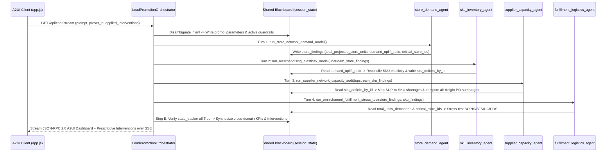
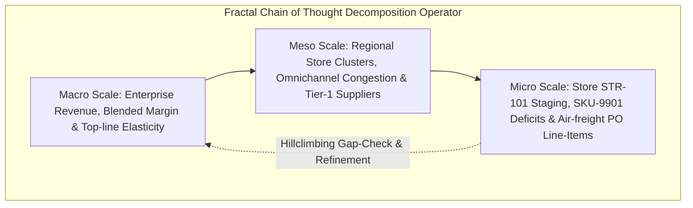

# ⚡ PROMO-SIM: ADK 2.x & A2UI Enterprise Promotion Simulation Platform

[](https://cloud.google.com/)
[](https://cloud.google.com/)
[](https://cloud.google.com/vertex-ai)
[](LICENSE)

> **Enterprise Mission Statement**:  
> *"Before I launch this promotion, show me exactly what will happen across every store, SKU, supplier, and fulfillment channel—and tell me the best intervention if something goes wrong."*

---

## 📑 Table of Contents
1. [Executive System Overview](#-executive-system-overview)
2. [Architectural Blueprint & State-Coupled Topology](#-architectural-blueprint--state-coupled-topology)
3. [Multi-Agent Core & 4-Pillar State Propagation Mesh](#-multi-agent-core--4-pillar-state-propagation-mesh)
4. [Fractal Chain of Thought (FCoT) Synthesis](#-fractal-chain-of-thought-fcot-synthesis)
5. [A2UI Schema-Driven Dynamic Component Factory](#-a2ui-schema-driven-dynamic-component-factory)
6. [Real-Time SSE JSON-RPC 2.0 Telemetry Stream](#-real-time-sse-json-rpc-20-telemetry-stream)
7. [Closed-Loop Prescriptive Interventions & Circuit Breakers](#-closed-loop-prescriptive-interventions--circuit-breakers)
8. [Repository Structure](#-repository-structure)
9. [Quickstart & Local Installation](#-quickstart--local-installation)
10. [Automated Verification & Test Suite](#-automated-verification--test-suite)
11. [Enterprise Cloud Deployment](#-enterprise-cloud-deployment)

---

## 🏛️ Executive System Overview

The **PROMO-SIM** platform is a distributed, multi-agent simulation and risk mitigation system engineered for retail merchandising, omnichannel logistics, and enterprise supply chain executives. Built on the **Google Cloud Agentic Stack** (**ADK 2.x**, **Vertex AI Gemini Enterprise**, and **Agent UI / A2UI**), the system stress-tests high-impact promotional campaigns before capital commitment.

Traditional retail promotion planning relies on siloed, static spreadsheet forecasting that fails to capture downstream supply bottlenecks. PROMO-SIM solves this by orchestrating a specialized mesh of autonomous domain subagents through a **Hub-and-Spoke topology**, synthesizing millions of simulated data points across four critical dimensions into a real-time reactive interface.

```
+---------------------------------------------------------------------------------------------------------+
|                                    PROMO-SIM COGNITIVE AGENTIC PIPELINE                                 |
|                                                                                                         |
|  [Promotional Scope]                                                                                    |
|          │                                                                                              |
|          ▼                                                                                              |
|  ┌───────────────────────────────┐                                                                      |
|  │  Lead Promotion Orchestrator  │ ──► [Macro/Meso/Micro FCoT Recursive Descent]                         |
|  └───────────────┬───────────────┘                                                                      |
|                  │                                                                                      |
|       ┌──────────┼──────────────────────┬──────────────────────┐                                        |
|       ▼          ▼                      ▼                      ▼                                        |
| ┌──────────┐ ┌──────────────┐ ┌──────────────────┐ ┌──────────────────────┐                             |
| │  Stores  │ │  SKU Demand  │ │ Supplier Network │ │ Fulfillment Channels │                             |
| │  Agent   │ │    Agent     │ │      Agent       │ │        Agent         │                             |
| └────┬─────┘ └──────┬───────┘ └────────┬─────────┘ └──────────┬───────────┘                             |
|      │              │                  │                      │                                         |
|      └──────────────┴──────────────────┴──────────────────────┘                                         |
|                                    │                                                                    |
|                                    ▼                                                                    |
|                    ┌───────────────────────────────┐                                                    |
|                    │  Multi-Scale Synthesis Engine │ ──► [4 Prescriptive Interventions + ROI Scoring]   |
|                    └───────────────┬───────────────┘                                                    |
|                                    │                                                                    |
|                                    ▼ [Server-Sent Events: JSON-RPC 2.0]                                 |
|                    ┌───────────────────────────────┐                                                    |
|                    │   A2UI Dynamic Client Engine  │ ──► [Tabs / Tables / Metrics / Live Action Cards]  |
|                    └───────────────────────────────┘                                                    |
+---------------------------------------------------------------------------------------------------------+
```

---

## 📐 Architectural Blueprint & State-Coupled Topology

The system enforces a strict **Hub-and-Spoke Topology**, a **Stateless Presentation / Stateful Orchestration Boundary**, and a **Shared Blackboard (`session_state`)** where each specialist agent's findings mathematically constrain downstream agents:



### Subagent Routing Isolation & ADK Lifecycle Hooks
To prevent circular delegation and infinite loops, all worker subagents enforce routing isolation and expose ADK-compliant `callback_context` lifecycle hooks:
```python
class StoreDemandAgent:
    def __init__(self):
        self.name = "store_demand_agent"
        self.disallow_transfer_to_parent = True
        self.disallow_transfer_to_peers = True

    def before_agent_callback(self, callback_context=None): ...
    def after_agent_callback(self, callback_context=None): ...
```

---

## 🤖 Multi-Agent Core & 4-Pillar State Propagation Mesh

| Subagent Name | Primary Tool Method | Upstream `session_state` Consumed | Downstream `session_state` Published | Closed-Loop Guardrail Response |
| :--- | :--- | :--- | :--- | :--- |
| **`store_demand_agent`** | `run_store_network_demand_model` | `promo_parameters` (`forecast_multiplier`, `duration_days`), `applied_interventions` | `store_findings`: `total_projected_store_units`, `demand_uplift_ratio`, `critical_store_ids`, `peak_store_risk_pct`, `store_matrix` | **`INTV-01`**: Adds +200 reserve stock to `STR-101`/`STR-112` & caps BOPIS intake (-10%).<br>**`INTV-03`**: Diverts SFS demand (-12%) from constrained stores. |
| **`sku_inventory_agent`** | `run_merchandising_elasticity_model` | `store_findings` (`demand_uplift_ratio`, `total_projected_store_units`), `promo_parameters` | `sku_findings`: `sku_deficits_by_id`, `deficit_units_num`, `net_unmitigated_deficit`, `total_promo_revenue_num`, `sku_matrix` | **`INTV-02`**: Injects expedited air-freight units (+1,200 `SKU-9901`, +800 `SKU-6612`).<br>**`INTV-04`**: Steps up `SKU-9901` price to `$699.99`, curbing velocity by 24%. |
| **`supplier_capacity_agent`** | `run_supplier_network_capacity_audit` | `sku_findings` (`sku_deficits_by_id`, `deficit_units_num`) via `SUPPLIER_TO_SKU_MAP` | `supplier_findings`: `required_emergency_surge_units`, `total_expedited_surcharge_num`, `constrained_suppliers`, `supplier_matrix` | **`INTV-02`**: Transitions `SUP-801` & `SUP-619` status to `EXPEDITED_PO_ACTIVE` with 6–8 day air-lift SLAs. |
| **`fulfillment_logistics_agent`** | `run_omnichannel_fulfillment_stress_test` | `store_findings` (`critical_store_ids`) + `sku_findings` (`total_units_demanded`) | `fulfillment_findings`: `total_omnichannel_orders`, `bopis_utilization_num`, `sfs_utilization_num`, `dc_headroom_pct`, `channel_matrix` | **`INTV-01` & `INTV-03`**: Reroutes overflow volume from `BOPIS` (112% $\rightarrow$ 88%) and `SFS` (104% $\rightarrow$ 83%) to `Central DC DTC`. |

---

## 🧠 Fractal Chain of Thought (FCoT) Synthesis

The `LeadPromotionOrchestrator` avoids flat, single-pass heuristic summaries. Instead, once `self.state_tracker` confirms all four specialist subagents have written their findings to `self.session_state`, it executes recursive descent across three distinct analytical scales:



1. **Macro-Scale Analysis**: Dynamically evaluates gross revenue (`sku_findings["total_promo_revenue_num"]`), top-line volume elasticity, and blended GMROI across any preset or custom discount prompt.
2. **Meso-Scale Analysis**: Pinpoints regional demand asymmetries (`store_findings["critical_store_ids"]`) and cross-channel capacity shifts (`fulfillment_findings["bopis_utilization_num"]` vs `dc_headroom_pct`).
3. **Micro-Scale Analysis**: Synthesizes exact store breach hours, per-SKU unit shortages (`sku_deficits_by_id`), and supplier emergency PO surcharges (`supplier_findings["total_expedited_surcharge_num"]`).

---

## 🎨 A2UI Schema-Driven Dynamic Component Factory

The presentation layer compiles UI widgets natively at runtime from declarative JSON-RPC data models. The client never requires code recompilation or bundle regeneration.

### Supported A2UI Component Primitives
- **`Dashboard`**: Root layout wrapper managing title, subtitle, and responsive component grids.
- **`MetricGrid`**: Responsive KPI card row dynamically populated from `session_state` with live status coloring (`positive`, `warning`, `critical`).
- **`Tabs` / `TabContent`**: Interactive multi-tab container isolating granular operational matrices.
- **`Table`**: Multi-column data grid with automated status badge formatting (`CRITICAL_STOCKOUT`, `OPTIMAL`, `CONSTRAINED`, `EXPEDITED_PO_ACTIVE`, `HIGH_RISK`).
- **`AlertBanner`**: Executive-grade risk broadcast banner with severity levels (`critical`, `warning`, `info`).
- **`Card`**: Rich text container parsing Markdown hierarchies, lists, and multi-scale synthesis notes.
- **`InterventionList`**: Actionable cards featuring trigger thresholds, dynamically quantified risk mitigation, implementation costs, projected ROI, and interactive **`⚡ Apply Intervention`** execution triggers.

---

## 📡 Real-Time SSE JSON-RPC 2.0 Telemetry Stream

The backend `/api/chat/stream` endpoint continuously pushes standardized JSON-RPC 2.0 frames over a single non-blocking `text/event-stream` pipeline, including live cross-agent parameters in `onToolCall`:

```json
/* 1. Intent Disambiguation & Reasoning Frame */
data: {"jsonrpc": "2.0", "method": "onAgentThought", "params": {"author": "LeadPromotionOrchestrator", "message": "Decomposing promotion pre-flight analysis for 'Summer Electronics & Appliance Blast (30-35% Off)' (Discount: 28-35%, Duration: 4d, Demand Multiplier: 2.7x)..."}}

/* 2. Predictive Handoff Frame (triggers glowing UI node) */
data: {"jsonrpc": "2.0", "method": "onAgentDelegation", "params": {"author": "LeadPromotionOrchestrator", "target": "sku_inventory_agent", "message": "Turn 2: Passing 15,900 projected store units (1.00x uplift) to SKU Elasticity & GMROI model."}}

/* 3. State-Coupled Tool Call Frame */
data: {"jsonrpc": "2.0", "method": "onToolCall", "params": {"author": "sku_inventory_agent", "tool": "run_merchandising_elasticity_model", "arguments": {"discount_tier": "28-35%", "upstream_store_units": 15900, "store_demand_uplift_ratio": 1.0}}}

/* 4. Declarative A2UI Schema Delivery Frame */
data: {"jsonrpc": "2.0", "method": "onUiComponentDelivery", "params": {"author": "LeadPromotionOrchestrator", "ui_specification": "2.0", "payload": {"type": "Dashboard", "id": "promotion_preflight_simulator", "components": [...]}}}

/* 5. Terminal Completion Frame */
data: {"jsonrpc": "2.0", "method": "onSimulationComplete", "params": {"status": "SUCCESS", "executive_decision": "ACTION_REQUIRED_BEFORE_LAUNCH", "interventions_count": 4, "projected_revenue_impact": "$6,073,794", "margin_protected": "$1,526,250"}}
```

---

## 🛡️ Closed-Loop Prescriptive Interventions & Circuit Breakers

When vulnerabilities are discovered during simulation, the orchestrator cross-correlates `store_findings`, `sku_findings`, `supplier_findings`, and `fulfillment_findings` to synthesize four high-ROI interventions:

```
+------------------------------------------------------------------------------------------------------------------------+
|                                    SYNTHESIZED PRESCRIPTIVE INTERVENTIONS MATRIX                                       |
+----------+------------------------------------+---------------+--------------------------------------+-----------------+
| ID       | Title                              | Priority      | Cross-Agent Trigger Threshold        | Closed-Loop Effect|
+----------+------------------------------------+---------------+--------------------------------------+-----------------+
| INTV-01  | Dynamic Digital Buffer Lock        | P0 IMMEDIATE  | Store stockout > 60% OR BOPIS > 100% | +400 reserve units; caps BOPIS at 90% |
| INTV-02  | Expedited Tier-1 Supplier Pre-PO   | P0 CRITICAL   | SKU stockout before Day 3 of promo   | +2,000 air-lift units (SUP-801/619)   |
| INTV-03  | Smart SFS-to-DC Fulfillment Guard  | P1 HIGH       | SFS backlog > 120 orders / store     | Diverts SFS volume to Central DC      |
| INTV-04  | Micro-Elasticity Margin Breaker    | P2 CONTINGENT | National stock < 15% before 48h      | Steps SKU-9901 to $699.99 (-24% vel)  |
+------------------------------------------------------------------------------------------------------------------------+
```

Users can click **`⚡ Apply Intervention`** directly within the A2UI interface (calling `/api/interventions/apply` to record the guardrail in `APPLIED_INTERVENTIONS`) and then click **`▶ Re-Run Multi-Agent Simulation`** to observe the closed-loop reduction in stockouts, SKU shortages, and channel congestion across all tabs.

---

## 📂 Repository Structure

```
bb-mission/
├── backend/
│   ├── __init__.py
│   ├── app.py                          # Core Flask API & SSE Event-Stream Controller
│   ├── orchestrator.py                 # FCoT Hub-and-Spoke Orchestrator & A2UI Builder
│   ├── requirements.txt                # Version-locked server dependencies
│   ├── agents/
│   │   ├── __init__.py
│   │   ├── store_agent.py              # Store foot traffic & localized stockout agent
│   │   ├── sku_agent.py                # SKU elasticity & unit economics agent
│   │   ├── supplier_agent.py           # Supplier lead-time & manufacturing agent
│   │   └── fulfillment_agent.py        # Omnichannel fulfillment & logistics agent
│   └── simulation/
│       ├── __init__.py
│       └── data_models.py              # Realistic enterprise catalog & telemetry data
├── frontend/
│   ├── templates/
│   │   └── index.html                  # Semantic Glassmorphic HTML5 Shell
│   └── static/
│       ├── css/
│       │   └── style.css               # HSL Design Tokens, animations & dark glass UI
│       └── js/
│           └── app.js                  # SSE Stream Parser & A2UI Component Factory
├── tests/
│   ├── __init__.py
│   └── test_backend.py                 # Automated pytest suite (9 tests, 100% pass)
├── architecture.md                     # Architectural specification & topologies
├── orchestration.md                    # Lead orchestrator FCoT protocol
├── sequential_multi_agent_development_guide.md # Multi-agent development best practices
├── GEMINI.md                           # Google Cloud Agentic Stack guidelines
└── README.md                           # Comprehensive design documentation
```

---

## 🚀 Quickstart & Local Installation

### Prerequisites
- Python 3.10+ (tested on Python 3.14)
- Google Cloud SDK (`gcloud`) authenticated with ADC

### 1. Clone & Environment Setup
```bash
git clone https://github.com/aarsanjani/bb-project.git
cd bb-project

python3 -m venv .venv
source .venv/bin/activate
pip install -r backend/requirements.txt
```

### 2. Configure Google Cloud Vertex AI Environment
```bash
export GOOGLE_GENAI_USE_VERTEXAI=true
export GOOGLE_CLOUD_PROJECT="arsanjani-genai"
export GOOGLE_CLOUD_LOCATION="us-central1"
export PYTHONPATH=.
```

### 3. Launch Application Server
```bash
python backend/app.py
```
Open **[http://localhost:5001](http://localhost:5001)** in your browser.

---

## 🧪 Automated Verification & Test Suite

The test suite validates session management, scenario presets, full SSE JSON-RPC schema delivery, subagent analytics, cross-agent `session_state` propagation, dynamic parameter sensitivity across presets, and closed-loop intervention circuit breakers:

```bash
PYTHONPATH=. .venv/bin/pytest tests/test_backend.py -v
```

### Test Results:
```
============================= test session starts ==============================
platform linux -- Python 3.14.3, pytest-9.1.1, pluggy-1.6.0
rootdir: /usr/local/google/home/styer/repos/bb-project
plugins: asyncio-1.4.0, mock-3.15.1

tests/test_backend.py::test_session_endpoint PASSED                               [  8%]
tests/test_backend.py::test_promotion_presets_endpoint PASSED                     [ 16%]
tests/test_backend.py::test_stream_endpoint_schema_compliance PASSED              [ 25%]
tests/test_backend.py::test_store_agent_analysis PASSED                           [ 33%]
tests/test_backend.py::test_sku_agent_analysis PASSED                             [ 41%]
tests/test_backend.py::test_supplier_agent_analysis PASSED                        [ 50%]
tests/test_backend.py::test_fulfillment_agent_analysis PASSED                     [ 58%]
tests/test_backend.py::test_apply_intervention_endpoint PASSED                    [ 66%]
tests/test_backend.py::test_apply_invalid_intervention_endpoint PASSED            [ 75%]
tests/test_backend.py::test_cross_agent_state_propagation PASSED                  [ 83%]
tests/test_backend.py::test_dynamic_parameter_sensitivity_across_presets PASSED   [ 91%]
tests/test_backend.py::test_closed_loop_intervention_effect PASSED                [100%]

============================== 12 passed in 0.37s ==============================
```

---

## ☁️ Enterprise Cloud Deployment

To deploy to **Google Cloud Run** using the **Google Cloud Agent Engine**:

```bash
# 1. Build and submit container image via Cloud Build
gcloud builds submit --tag gcr.io/arsanjani-genai/promo-sim-a2ui:latest

# 2. Deploy serverless container to Cloud Run
gcloud run deploy promo-sim-a2ui \
    --image gcr.io/arsanjani-genai/promo-sim-a2ui:latest \
    --platform managed \
    --region us-central1 \
    --allow-unauthenticated \
    --set-env-vars GOOGLE_GENAI_USE_VERTEXAI=true,GOOGLE_CLOUD_PROJECT=arsanjani-genai,GOOGLE_CLOUD_LOCATION=us-central1
```

---

## 📄 License
This project is licensed under the Apache License 2.0.
